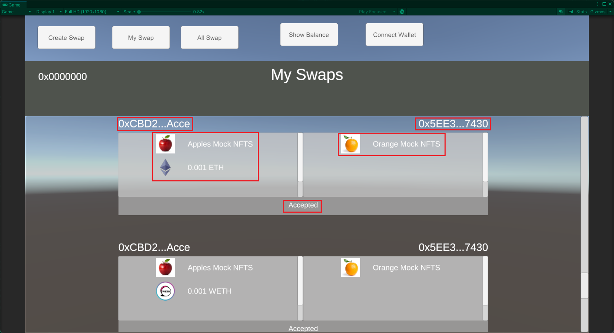
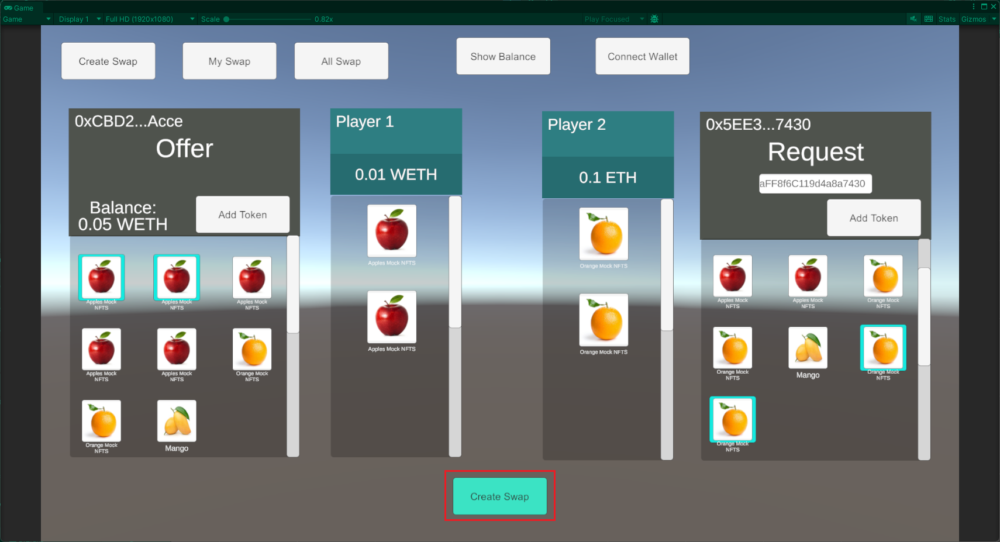
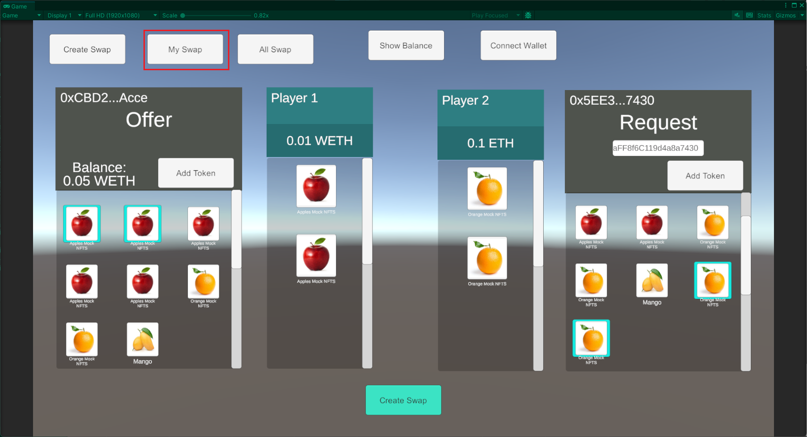

# Mystic Unity SDK

***

## Getting Started

### About
* The Mystic Unity SDK is a package that enables game developers to build NFT marketplaces and swapping experiences in-game, fully leveraging blockchain capabilities with minimum complexity.

### How it Works
* Flow how MysticSwap Unity SDK (from in-game interaction to API Call)
* Explain it with graph contains layer in Unity (game dev interact with), layer from Mystic SDK side
* This SDK is based on this https://docs.withmystic.xyz/

### Onboarding
* How to use this docs, what should understand before building Web3 Game
* Basic Web3 interaction such as trading NFTs collection, but don't worry since in this guide is pretty straight forward with the project samples

***

## Tutorial(s)

### Requirements
1. Unity (any version works);
2. Download the Mystic Unity SDK package [here](https://github.com/mysticswap/mystic-unity-sdk/releases).
3. MetaMask Wallet (more wallets coming soon).

### Installation
1. Create a new Unity Project (Any template) or open an existing one.
2. Open the project and import the Mystic Unity package by selecting the menu **Assets -> Import Package -> Custom Package...**<br>

3. A new window will pop-up, in which you need to select the **MysticUnitySDK.unitypackage** file.

4. Import **All** items<br>

5. Click **Import**
> At this point, you might see an error saying "an external package named *newtonsoft.json* needs to be installed." <br>
> ***newtonsoft.json*** is an utility package for processing json text into another data type and vice versa.

To install newtonsoft.json, please follow these steps:

1. Select the menu **Window -> Package Manager**<br>

2. In the *Package Manager* window, click the **+** icon in the top-left corner

3. Choose **Add package from git URL...**
4. Add this inside the URL text box: `com.unity.nuget.newtonsoft-json`

5. Click **Add**
6. Wait until the installation has finished
7. Check the Console window inside the Unity Editor, to make sure no error has occurred.

### Setup

#### Setting up the Scene
To get started, you will need to add the **MysticSDKManager** and **MetaMaskUnity** prefabs to Hierarchy.<br>
* The **MysticSDKManager** prefabs will grant you access to all of our API's functionalities, which you can find [here](https://docs.withmystic.xyz/swaps-and-marketplace-api). It also contains wallet configuration data like Wallet Address, Authentication Token and ChainId.
* The **MetaMaskUnity** prefabs are for wallet-related functionality, like sending transaction requests to your MetaMask Mobile Apps from Unity.
* The prefabs work as a Singleton that can be called anywhere inside your game.

To insert these prefabs, inside the scene add (drag and drop) the prefabs named *MysticSDKManager* and *MetaMaskUnity* into **Hierarchy**.

> These prefabs are located inside *Project folders* in **Assets -> Prefabs**

<br>


#### Wallet configuration
We will need to set up  the players' Wallet Address and chainId, so we can have it communicate with the SDK. We will be assuming you use MetaMask here, for simplicity.
* You can add the address in the MysticSDKManager or you can connect it via the "Connect Wallet" button, which you can do via the MetaMask Wallet Provider available in the package.

Go to Hierarchy and click the **MysticSDKManager** prefab. In the Script box you will find this:<br>

* Wallet Address: input the Wallet Address that will be used in-game as the main address.
* Authentication Token: Add Bearer Authentication token (to get the token, follow the instructions [here](https://docs.withmystic.xyz/swaps-and-marketplace-api/authentication))
* Chain Id: Add Chain Id. Supported Chain Ids can be seen [here](https://docs.withmystic.xyz/supported-blockchains).

### Get Your Balance
Let's get your wallet balance (sdk.getBalance). Here, you will get ETH and WETH in json format. You can also use sdk.GetBalanceETH to get just the ETH balance and sdk.GetBalanceWETH to get just the WETH balance and display it in your game.

To demonstrate this, let's make a scene with a button interaction that will do the API call.
1. Make sure to set up the SDK, for both Scene and MysticSDKManager. [*Setting up the Mystic SDK*](https://github.com/mysticswap/mystic-unity-sdk/blob/temp/docs/docs/UnitySDK-Structure-Documentation.md#setting-up).
2. Create an **Empty GameObject**, let's name it **ScriptManager**.<br>
<br>

3. Put the **ScriptManager.cs** script inside the GameManager.<br>


4. Create a Canvas with 3 buttons and 1 Text Mesh Pro:<br>
<br>

    a. Button_ShowBalance: json string of balance (both ETH and WETH).<br>
    b. Button_ShowBalanceEth: balance of ETH.<br>
    c. Button_ShowBalanceWeth: balance of WETH.<br>
    d. Text_DisplayBalance: to display the output of each buttons.
5. Go to the **ScriptManager.cs** and add this code:<br>
    a. Define the SDK Variable
    ```cs
    private MysticSDK _sdk;
    ```

    b. Define the GameObject Variable
    ```cs
    [SerializeField] private TextMeshProUGUI textDisplayBalance;
    ```

    c. Instantiate the SDK on `Awake()`
    ```cs
    private void Awake()
    {
        _sdk = MysticSDKManager.Instance.sdk;
    }
    ```

    d. Create buttons' method to show the balance
    ```cs
    public async void ShowBalance()
    {
        var result = await _sdk.GetBalance();
        textDisplayBalance.text = result;
    }

    public async void ShowBalanceEth()
    {
        var result = await _sdk.GetBalanceEth();
        textDisplayBalance.text = result;
    }

    public async void ShowBalanceWeth()
    {
        var result = await _sdk.GetBalanceWeth();
        textDisplayBalance.text = result;
    }
    ```
   
    e. This is the full code looks like. This code is located in `Assets/Samples/GetYourBalanceSample/Scripts/ScriptManager.cs`.
    ```cs
   using Core;
   using TMPro;
   using UnityEngine;

   public class ScriptManager : MonoBehaviour
   {
        private MysticSDK _sdk;
        [SerializeField] private TextMeshProUGUI textDisplayBalance;

        private void Awake()
        {
            _sdk = MysticSDKManager.Instance.sdk;
        }

        public async void ShowBalance()
        {
            var result = await _sdk.GetBalance();
            textDisplayBalance.text = result;
        }

        public async void ShowBalanceEth()
        {
            var result = await _sdk.GetBalanceEth();
            textDisplayBalance.text = result;
        }

        public async void ShowBalanceWeth()
        {
            var result = await _sdk.GetBalanceWeth();
            textDisplayBalance.text = result;
        }
    }
    ```
6. Apply GameObject to the **ScriptManager**.<br>

7. Apply the `ShowBalance()`, `ShowBalanceEth()` and `ShowBalanceWeth()` methods to each of the buttons.<br>
 Interaction")<br>
")<br>
")<br>
 function will be shown")<br>
 on Button_ShowBalanceEth")<br>
 on Button_ShowBalanceWeth")<br>
8. Play the game.
9. Click the button, you should see your balance on the Text display.<br>

<br>
<br>
<br>
> CONGRATULATIONS!!! You just interacted with Web3 in-game!

### Build your first NFT swapping experience
* In this tutorial you will learn how to:
    * Access you tokens in-game
    * Create public or private swaps
    * Create Swaps in-game
    * See all created swaps
    * Accept or cancel swaps in-game
    * Make swaps work on different chains
    * Live Swaps (coming soon)

#### Using Mystic SDK's Swap Experience Sample
This experience lets players propose other players exchanges of any combination of assets (e.g. I want to trade two belts for your shield + 0.2ETH). Players may then accept or not said proposed trades. A full experience will allow players to create swaps for each other, as well as include a place where players can see the swaps that have been created, so they may browse and accept them. Let's look at how to implement this.

* Go to the Project window, **Assets → Scenes → SwapInGameSample**<br>
  
* On this scene, there are some panels to interact with the ***items (NFTs and ERC20 Tokens)***:<br>
  <br>
  
  1. SDKPanel_Tabs: contains buttons to switch between the panels
     * *Create Swap* Button: will activate the SDKPanel_CreateSwap
     * *My Swap* Button: will activate the SDKPanel_MySwaps
     * *All Swap* Button: will activate the SDKPanel_AllSwaps
     * Panel_ConnectAndShowBalance: basic Wallet interactions, namely showing your balance in a Console window (`Debug.Log`) and connecting your MetaMask Wallet.
       * *Show Balance* Button: display your ETH and WETH balance in the Console window.
       * *Connect Wallet* Button: connect Wallet with MetaMask as a provider.
  2. SDKPanel_CreateSwap: contains offer and request panels so players can propose swaps to each other.
     * Offer Panel: displays current player's assets.
     * Request Panel: displays counterparty's assets.<br>
     *Note*: swaps can be public (anyone can accept them) or private (only a specific wallet address can accept them). See more [here](https://docs.withmystic.xyz/swaps-and-marketplace-api/create-swap-offer).
     You can make a *private* swap by adding the the other player's address on the Request side,
     otherwise leave it blank to make the swap *public*.
  3. SDKPanel_MySwaps: retrieve and display swaps created by or for the connected address.<br>
        So players can see their history, and since swaps can be cancelled, you can also see Accepted
      or Cancelled swaps.<br>
     <br>
     * Every swap has a Creator side and a Taker side, as well as a button for the counterparty to
       Accept/Cancel the swap. Button will be replaced by status Accepted/Cancelled if it's already closed:
       * Creator Address (left side)
       * Creator Items (*NFTs and ERC20 Tokens*)
       * Taker Address (right side)
       * Taker Items 
  5. SDKPanel_AllSwaps: similar to SDKPanel_MySwaps, but it displays all swaps created in Mystic SDK.
     

##### Let's create a swap in-game!
1. First, let's setup your [wallet](https://github.com/mysticswap/mystic-unity-sdk/blob/temp/docs/docs/UnitySDK-Structure-Documentation.md#setting-up-your-wallets-configuration) inside the MysticSDKManager on Hierarchy, and then **PLAY** the game. Filling the Authentication Token and Chain Id is mandatory, but for Wallet Address you can also add it by connecting to MetaMask via the ***Connect Wallet*** button. 
Once your wallet is connected, your assets will show up on the Offer side.<br>
   
2. To do a private swap, add target wallet Address inside the ***Request's input field***, press enter and NFTs collection on the Request side will be shown. Meanwhile, to do a public swap, just leave the Wallet Address blank. <br>
   
3. Add items you want to swap by clicking on them. You can add Tokens by pressing the ***Add Token*** button, entering the amount desired and clicking ***Confirm*** button.
    Items will be added to trade box automatically when selected, so it's clear what the trade terms are.
   <br>
   <br>
   <br>
   
4. Once you are done with adding items on both sides, click the ***Create Swap*** button. A QR Code will appear for you to connect to your MetaMask Wallet (if you didn't do Connect Wallet at the beginning). Scan the QR code with your MetaMask Mobile App.<br>
   <br>
   
5. Sign the request in your MetaMask mobile app.
6. In the game, wait until a message saying "Created Swap" appears.<br>
   
7. Click the ***My Swaps*** button, and you will see the swaps you just created.<br>
   <br>
   <br>
> CONGRATULATIONS!! You have just created you first swap in-game. Now, edit the UI to match your game's experience, connect it to your existing wallet provider and you should be good to go! Any questions? Contact us [here](https://docs.withmystic.xyz/support).

***

## Examples
    - Example Assets
    - Example Prefabs
    - Example Scripts
    - Samples

## Samples
We provide working samples for implementing features on Mystic Unity SDK.
### 1. *Get Your Balance* Sample
* Scripts: `ScriptManager.cs` contains a script that enables you to do do basic implementations, such as calling the Mystic Unity SDK and retrieving wallet balances.
* Scenes: `GetYourBalanceSample.unity` is a scene that demonstrate how to Get Balance from the Mystic API using buttons to interact with. Results are displayed in a Text Display.

### 2. *Swap In-Game* Sample
* Game Events
  * `OnWalletOfferConnected.asset` is triggered once the current player's wallet is connected to the game, and immediately shows the wallet's inventory.
  * `OnWalletRequestConnected.asset` behaves the same as `OnWalletOfferConnected.asset`, but for the other player in the swap.
  * `TradeBoxRefreshItems_Offer.asset` is triggered every time the current player clicks an item or the "add Token" button, to display the selected items or Tokens in the Trade Box.
  * `TradeBoxRefreshItems_Request.asset` behaves the same as `TradeBoxRefreshItems_Offer.asset`, but for the other player in the swap.
* Prefabs
  * `Button_ConnectWallet.prefab` is a button to connect a MetaMask wallet.
  * `NFTsItem.prefab` are used in Panel_Swaps. It represents a single NFT or Token.
  * `OwnedNFTButton.prefab` is a clickable item inside the player's inventory.
  * `Panel_Swaps.prefab` is a Panel to display swaps already created. It contains all involved NFTsItem, an action button (Accept/Cancel) or swap status (Accepted/Cancelled), as well as the counterparty address if applicable.
  * `Panel_TradeBox.prefab` is a trade box that displays selected NFTs and/or Tokens to trade.
  * `TradeItem.prefab` is a single NFT inside of Panel_TradeBox. 
* Scenes: `SwapInGameSample.unity` is a scene for creating swaps between players. It also enables showing all created swaps.
* Scripts
  * `ConnectedWalletButton.cs`: connect wallet via MetaMask, will trigger GameEvent `OnWalletOfferConnected` once connected.
  * `GameManager.cs`: the main script of this scene, it includes automaticically connecting wallet if the MysticSDKManager has already been configured, loading NFTs, creating swaps, retrieving swaps and more.
  * `GetRemoteTexture.cs`: class to load images of NFTs from its ImageUrl.
  * `NFTsItem.cs`: single item inside the displayed NFT on Trade Box.
  * `NftItem.cs`: class to load and store the data of the item.
  * `NftItems.cs`: list data of NFTs on Offer and Request side.
  * `OwnedNFTButton.cs`: button script for the NFTs inside a player's inventory.
  * `PanelTradeBox.cs`: Trade Box fucntionality (add, remove, display NFTs and ERC20 tokens).
  * `SwapsPanel.cs`: panel script to load created swaps from Mystic API.
  * `TradeItem.cs`: a single item on Trade Box (loads text title and imageUrl).
  * `ITradeBox.cs`: interface for Trade Box.

***

<a name='assembly'></a>
## Scripts

## Contents

- [MysticSDK](#T-Core-MysticSDK 'Core.MysticSDK')
    - [AcceptSwap(request)](#M-Core-MysticSDK-AcceptSwap 'Core.MysticSDK.AcceptSwap')
    - [CancelSwap(request)](#M-Core-MysticSDK-CancelSwap 'Core.MysticSDK.CancelSwap')
    - [CreateSwap(request)](#M-Core-MysticSDK-CreateSwap 'Core.MysticSDK.CreateSwap')
    - [GetAddress()](#M-Core-MysticSDK-GetAddress 'Core.MysticSDK.GetAddress')
    - [GetBalance()](#M-Core-MysticSDK-GetBalance 'Core.MysticSDK.GetBalance')
    - [GetBalanceEth()](#M-Core-MysticSDK-GetBalanceEth 'Core.MysticSDK.GetBalanceEth')
    - [GetBalanceWeth()](#M-Core-MysticSDK-GetBalanceWeth 'Core.MysticSDK.GetBalanceWeth')
    - [GetMetadata(request)](#M-Core-MysticSDK-GetMetadata 'Core.MysticSDK.GetMetadata')
    - [GetNfts(_address)](#M-Core-MysticSDK-GetNfts-System-String- 'Core.MysticSDK.GetNfts(System.String)')
    - [GetOwnedNFTs(_address)](#M-Core-MysticSDK-GetOwnedNFTs-System-String- 'Core.MysticSDK.GetOwnedNFTs(System.String)')
    - [RetrieveAllSwaps(page,limit)](#M-Core-MysticSDK-RetrieveAllSwaps-System-Int32,System-Int32- 'Core.MysticSDK.RetrieveAllSwaps(System.Int32,System.Int32)')
    - [RetrieveMySwaps(page,limit,creatorAddress,takerAddress)](#M-Core-MysticSDK-RetrieveMySwaps-System-Int32,System-Int32,System-String,System-String- 'Core.MysticSDK.RetrieveMySwaps(System.Int32,System.Int32,System.String,System.String)')
    - [RetrieveSwap(swapId)](#M-Core-MysticSDK-RetrieveSwap-System-String- 'Core.MysticSDK.RetrieveSwap(System.String)')
    - [SetAddress(address)](#M-Core-MysticSDK-SetAddress-System-String- 'Core.MysticSDK.SetAddress(System.String)')

<a name='T-Core-MysticSDK'></a>
## MysticSDK `type`

##### Namespace

Core

<a name='M-Core-MysticSDK-AcceptSwap'></a>
### AcceptSwap(request) `method`

##### Summary

Accept a listed swap / offer.

##### Returns

Result of request.

##### Parameters

| Name | Type | Description |
| ---- | ---- | ----------- |
| request | [M:Core.MysticSDK.AcceptSwap](#T-M-Core-MysticSDK-AcceptSwap 'M:Core.MysticSDK.AcceptSwap') | SwapData type that contains swapId and takerAddress. |

<a name='M-Core-MysticSDK-CancelSwap'></a>
### CancelSwap(request) `method`

##### Summary

Cancel a listed swap / offer.

##### Returns

Result of request.

##### Parameters

| Name | Type | Description |
| ---- | ---- | ----------- |
| request | [M:Core.MysticSDK.CancelSwap](#T-M-Core-MysticSDK-CancelSwap 'M:Core.MysticSDK.CancelSwap') | SwapData type that contains swapId and takerAddress. |

<a name='M-Core-MysticSDK-CreateSwap'></a>
### CreateSwap(request) `method`

##### Summary

Create a new swap or make an offer on a listed NFT.

##### Returns

Result of request.

##### Parameters

| Name | Type | Description |
| ---- | ---- | ----------- |
| request | [M:Core.MysticSDK.CreateSwap](#T-M-Core-MysticSDK-CreateSwap 'M:Core.MysticSDK.CreateSwap') | CreateSwap type to be requested (please see GameManager.cs CreateSwap() to see the implementation. |

<a name='M-Core-MysticSDK-GetAddress'></a>
### GetAddress() `method`

##### Summary

Get wallet address from the SDK session.

##### Returns

Address as a string.

##### Parameters

This method has no parameters.

<a name='M-Core-MysticSDK-GetBalance'></a>
### GetBalance() `method`

##### Summary

Get ETH and WETH Balances from the SDK session address.

##### Returns

Return a json containing ETH and WETH balances as strings.

##### Parameters

This method has no parameters.

<a name='M-Core-MysticSDK-GetBalanceEth'></a>
### GetBalanceEth() `method`

##### Summary

Get ETH balance from the SDK session address.

##### Returns

ETH as a string.

##### Parameters

This method has no parameters.

<a name='M-Core-MysticSDK-GetBalanceWeth'></a>
### GetBalanceWeth() `method`

##### Summary

Get WETH balance from the SDK session address.

##### Returns

WETH as a string.

##### Parameters

This method has no parameters.

<a name='M-Core-MysticSDK-GetMetadata'></a>
### GetMetadata(request) `method`

##### Summary

Retrieve metadata of a single NFTItem.

##### Returns

Metadata in json.

##### Parameters

| Name | Type | Description |
| ---- | ---- | ----------- |
| request | [M:Core.MysticSDK.GetMetadata](#T-M-Core-MysticSDK-GetMetadata 'M:Core.MysticSDK.GetMetadata') | Metadata type of NFTItem. |

<a name='M-Core-MysticSDK-GetNfts-System-String-'></a>
### GetNfts(_address) `method`

##### Summary

Get NFTs from a particular address.

##### Returns

Json containing all NFTs.

##### Parameters

| Name | Type | Description |
| ---- | ---- | ----------- |
| _address | [System.String](http://msdn.microsoft.com/query/dev14.query?appId=Dev14IDEF1&l=EN-US&k=k:System.String 'System.String') | By default it will be the session's address. |

<a name='M-Core-MysticSDK-GetOwnedNFTs-System-String-'></a>
### GetOwnedNFTs(_address) `method`

##### Summary

Get NFTs in form of OwnedNFT types (see Types.cs).

##### Returns

List of NFTs.

##### Parameters

| Name | Type | Description |
| ---- | ---- | ----------- |
| _address | [System.String](http://msdn.microsoft.com/query/dev14.query?appId=Dev14IDEF1&l=EN-US&k=k:System.String 'System.String') | By default it will be the session's address. |

<a name='M-Core-MysticSDK-RetrieveAllSwaps-System-Int32,System-Int32-'></a>
### RetrieveAllSwaps(page,limit) `method`

##### Summary

Retrieve all existing swaps.

##### Returns

A list of swaps according to the made request.

##### Parameters

| Name | Type | Description |
| ---- | ---- | ----------- |
| page | [System.Int32](http://msdn.microsoft.com/query/dev14.query?appId=Dev14IDEF1&l=EN-US&k=k:System.Int32 'System.Int32') | Number of pages we want to retrieve. Default is 1. |
| limit | [System.Int32](http://msdn.microsoft.com/query/dev14.query?appId=Dev14IDEF1&l=EN-US&k=k:System.Int32 'System.Int32') | Number of swaps we want to retrieve. Default is 20, limit is 100 |

<a name='M-Core-MysticSDK-RetrieveMySwaps-System-Int32,System-Int32,System-String,System-String-'></a>
### RetrieveMySwaps(page,limit,creatorAddress,takerAddress) `method`

##### Summary

Retrieve all existing swaps associated with a the particular address.

##### Returns

A list of swaps according to the made request.

##### Parameters

| Name | Type | Description |
| ---- | ---- | ----------- |
| page | [System.Int32](http://msdn.microsoft.com/query/dev14.query?appId=Dev14IDEF1&l=EN-US&k=k:System.Int32 'System.Int32') | Number of pages we want to retrieve. Default is 1. |
| limit | [System.Int32](http://msdn.microsoft.com/query/dev14.query?appId=Dev14IDEF1&l=EN-US&k=k:System.Int32 'System.Int32') | Number of swaps we want to retrieve. Default is 20, limit is 100 |
| creatorAddress | [System.String](http://msdn.microsoft.com/query/dev14.query?appId=Dev14IDEF1&l=EN-US&k=k:System.String 'System.String') | By default it will be the session's address. |
| takerAddress | [System.String](http://msdn.microsoft.com/query/dev14.query?appId=Dev14IDEF1&l=EN-US&k=k:System.String 'System.String') | By default it will be the session's address. |

<a name='M-Core-MysticSDK-RetrieveSwap-System-String-'></a>
### RetrieveSwap(swapId) `method`

##### Summary

Retrieve a single swap object.

##### Returns

The respective swap object.

##### Parameters

| Name | Type | Description |
| ---- | ---- | ----------- |
| swapId | [System.String](http://msdn.microsoft.com/query/dev14.query?appId=Dev14IDEF1&l=EN-US&k=k:System.String 'System.String') | String of swapID. |

<a name='M-Core-MysticSDK-SetAddress-System-String-'></a>
### SetAddress(address) `method`

##### Summary

Set the address of the SDK session.

##### Parameters

| Name | Type | Description |
| ---- | ---- | ----------- |
| address | [System.String](http://msdn.microsoft.com/query/dev14.query?appId=Dev14IDEF1&l=EN-US&k=k:System.String 'System.String') | String of address that will replace to. |


***

## Editor Tools
*Coming Soon*

***

## Glossary
*Coming Soon*
