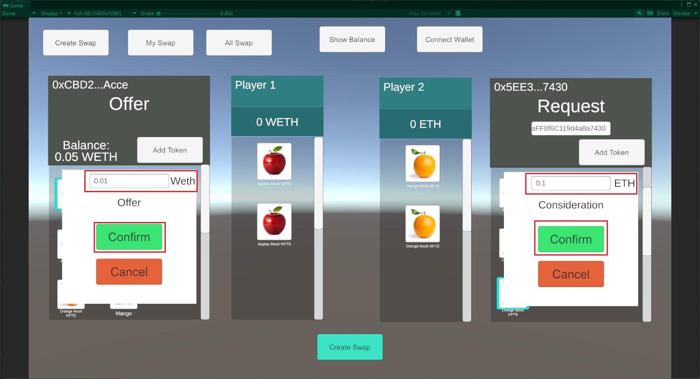
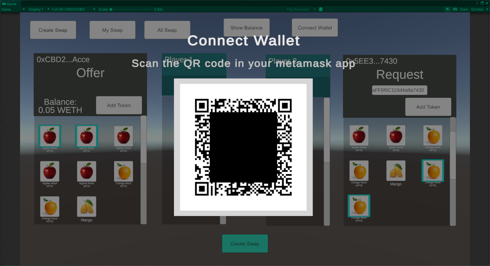

# MysticSwap Unity SDK

***

## Getting Started

### About MysticSwap Unity SDK
* Is a package on Unity to help connect Game Development with Web3 such as trade NFTs collection in-game, or microtransaction with blockchain.

### How it Works
* Flow how MysticSwap Untiy SDK (from in-game interaction to API Call)
* Explain it with graph contains layer in Unity (game dev interact with), layer from Mystic SDK side
* This SDK is based on this https://docs.withmystic.xyz/

### OnBoarding
* How to use this docs, what should understand before building Web3 Game
* Basic Web3 interaction such as trading NFTs collection, but don't worry since in this guide is pretty straight forward with the project samples

***

## Tutorial(s)

### Overview
Here is what you need to prepare:
1. Unity (any version should works)
2. Mystic Unity SDK package (_link coming soon_) `[TODO: make package's downloadable link]`
3. MetaMask Wallet Address

### Installation
1. Create new Unity Project (Any template) or open your existing project.
2. Once project is opened, export the downloaded Mystic Unity package by selecting the menu **Assets -> Import Package -> Custom Package...**<br>

3. New window will pop-up, locate the **MysticUnitySDK.unitypackage** file.

4. Import **All** items<br>

5. Click **Import**
> At this point, Unity compiler will show the error, an external package named *newtonsoft.json* need to be installed. <br>
> ***newtonsoft.json*** is an utility package for processing json text into another data type and vice versa.

> *coming soon to install this external package on MysticSDK Manager Tools*

To install the external package (newtonsoft.json), follow this step:

1. Select the menu **Window -> Package Manager**<br>

2. At the *Package Manager* window, click the **+** icon at the top-left corner

3. Choose **Add package from git URL...**
4. Add this inside the URL text box: `com.unity.nuget.newtonsoft-json`

5. Click **Add**
6. Please wait until the installation finished
7. Check the Console window inside the Unity Editor, make sure there is no error occurred.

### Setting up

#### Setting up the Scene
To get started, **MysticSDKManager** and **MetaMaskUnity** prefabs are needed to put inside the Hierarchy.<br>
* **MysticSDKManager** prefabs will grant access of the SDK functionality in your code like API call from [Mystic](https://docs.withmystic.xyz/swaps-and-marketplace-api) and it contains the wallet configuration data like Wallet Address, Authentication Token and ChainId.
* **MetaMaskUnity** prefabs is for wallet related functionality like sending transaction request to your MetaMask Mobile Apps from Unity.
* These prefabs are work as a Singleton that can be called anywhere inside your game.

To insert these prefabs, inside the scene add (drag and drop) prefabs named *MysticSDKManager* and *MetaMaskUnity* into the **Hierarchy**.

> These prefabs are located inside *Project folders* in **Assets -> Prefabs**

<br>


#### Setting up your Wallet's configuration
In order of the Player to access the wallet in-game, Wallet's detail need to be adjusted. Here is how to setting up the Player's Wallet Address, and chainId. Including the AuthenticationToken for the API Call requirement.
* You could add your address inside the MysticSDKManager or you can connect it with Connect Wallet button with MetaMask Wallet Provider available on the package [here is the link to getting started]

To setting up the configuration, go to Hierarchy, click **MysticSDKManager** prefab, in the Script box you will find:<br>

* Wallet Address: fill your Wallet Address that will be use in-game as the main address (MetaMask)
* Authentication Token: Add Bearer Authentication token (can be found in here) `[TODO: add link]`
* Chain Id: Add available Chain Id `[TODO: add list of Chain Id along with its Contract Address]`

### Get Your Balance
Let's do the first call to get the balance from your address. (sdk.getBalance), here you will get ETH and WETH in json format, or sdk.GetBalanceETH to get the ETH balance and sdk.GetBalanceWETH to get the WETH balance and display it to your game [here is the sample]

To demonstrate this, let's make a scene with button interaction to do the API call.
1. Make sure to setting up the SDK, for both Scene and MysticSDKManager. [*Setting up the Mystic SDK*](https://github.com/mysticswap/mystic-unity-sdk/blob/temp/docs/docs/UnitySDK-Structure-Documentation.md#setting-up).
2. Create an **Empty GameObject**, let's name it as **ScriptManager**.<br>
<br>

3. Put **ScriptManager.cs** script inside the GameManager.<br>


4. Create a Canvas with 3 buttons and 1 Text Mesh Pro:<br>
<br>

    a. Button_ShowBalance: json string of balance (both ETH and WETH).<br>
    b. Button_ShowBalanceEth: balance of ETH.<br>
    c. Button_ShowBalanceWeth: balance of WETH.<br>
    d. Text_DisplayBalance: to display the output of each buttons.
5. Go to the **ScriptManager.cs** and let's do some codes:<br>
    a. Define the SDK Variable
    ```cs
    private MysticSDK sdk;
    ```

    b. Define the GameObject Variable
    ```cs
    [SerializeField] private TextMeshProUGUI Text_DisplayBalance;
    ```

    c. Instantiate the SDK on `Awake()`
    ```cs
    private void Awake()
    {
        sdk = MysticSDKManager.Instance.sdk;
    }
    ```

    d. Create buttons' method to show the balance
    ```cs
    public async void ShowBalance()
    {
        var result = await sdk.GetBalance();
        Text_DisplayBalance.text = result;
    }

    public async void ShowBalanceEth()
    {
        var result = await sdk.GetBalanceEth();
        Text_DisplayBalance.text = result;
    }

    public async void ShowBalanceWeth()
    {
        var result = await sdk.GetBalanceWeth();
        Text_DisplayBalance.text = result;
    }
    ```
6. Apply GameObject into the **ScriptManager**.<br>

7. Apply the `ShowBalance()`, `ShowBalanceEth()` and `ShowBalanceWeth()` methods into each of the buttons.<br>
 Interaction")<br>
")<br>
")<br>
 function will be shown")<br>
 on Button_ShowBalanceEth")<br>
 on Button_ShowBalanceWeth")<br>
8. Play the game.
9. Click the button, then you will see your balance on Text display.<br>

<br>
<br>
<br>
> CONGRATULATIONS!!! You just interacted with Web3 In-game!

### Build your first NFT swapping experience
* In this tutorial you will able to:
    * Accessing you NFTs collection inventory
    * Open swap to public or private swap (given the Requester's address)
    * Create Swap in-game
    * See all created swaps
    * Accept or cancel swap in-game
    * Make swaps work on different chains
    * Live Swaps (coming soon)

#### Using Mystic SDK Swap Experience Sample
You can find a scene sample for experiencing NFT swapping.
* Go to the Project window, **Assets → Scenes → SwapInGameSample**<br>
  
* On this scene there are some panels to interact with the ***items (NFTs collection or Token)***:<br>
  <br>
  
  1. SDKPanel_Tabs: contains buttons to switch between the panels
     * CreateSwap Button: to activate the SDKPanel_CreateSwap
     * MySwap Button: to activate the SDKPanel_MySwaps
  2. SDKPanel_CreateSwap: contains offer and request panel to create swap between items.
     * Offer Panel: main player side to select their items to be trade.
     * Request Panel: other player side inventory (swap target) which main player select the items to request them.<br>
     *Notes*: there two kind of swaps which are public and private, as mentioned [here](https://docs.withmystic.xyz/swaps-and-marketplace-api/create-swap-offer),
     you can make a *private* swap by adding the address on Request side,
     otherwise leave the Request's address blank to make it *public*.
  3. SDKPanel_BalanceAndConnect: basic Wallet interactions to show balance in a Console window (`Debug.Log`) and connect your Wallet with MetaMask.
     * Show Balance Button: show your ETH and WETH balance in the Console window.
     * Connect Wallet Button: connect Wallet with MetaMask provider.
  4. SDKPanel_MySwaps: retrieve swaps owned by connected address.<br>
        On This panel, created swaps panel will be shown just like in https://mysticswap.io/sdk (in *My Swaps* section) to get the experience of 
        accept or cancel swaps in-game, you can also see Accepted or Cancelled swaps.<br>
     <br>
     * On Every single swaps contains Creator side and Taker side with button Accept/Cancel or status Accepted/Cancelled:
       * Creator Address (left side)
       * Creator Items (*NFTs collections or Token*)
       * Taker Address (right side)
       * Taker Items 
##### Let's experience create swap in-game!
`[TODO: Add transaction panel ~trade box]`
1. First, setup your [wallet configuration](https://github.com/mysticswap/mystic-unity-sdk/blob/temp/docs/docs/UnitySDK-Structure-Documentation.md#setting-up-your-wallets-configuration) inside the MysticSDKManager on Hierarchy, then **PLAY** the game. Fill the Authentication Token and Chain Id is mandatory, but for Wallet Address you can also add it by connecting to MetaMask via the ***Connect Wallet*** button `[TODO: sync Offer panel with Connect Wallet Button]`
Once the wallet is connected, NFTs collection will be shown up on Offer side.<br>
   
2. To do a private swap, add target wallet Address inside the ***Request's input field***, press enter and NFTs collection in the Request side will be shown. Meanwhile, to do a public swap, just leave the Wallet Address blank. `[TODO: test public swap functionality]`<br>
   
3. Add items you want to swap by clicking on it, and you could add Token by pressing the ***Add Token*** button, enter the amount and click ***Confirm*** button. `[TODO: show added token on transaction panel]`<br>
   <br>
   
4. Once you are done with adding items on both side, click ***Create Swap*** button, and QR Code will be shown to connect to the MetaMask Wallet (if you didn't Connect Wallet at the beginning). Scan the QR code with your MetaMask Mobile App.<br>
   <br>
   
5. Sign the request on your MetaMask mobile apps.
6. Inside the game wait until a message created swap appears. `[TODO: create pop-up message swap created]`
7. Click the ***My Swap*** button, and you will see the swaps you just created.<br>
   <br>
   <br>
> CONGRATULATIONS!! You have just created NFTs swap in-game!

***

## Examples
    - Example Assets
    - Example Prefabs
    - Example Scripts
    - Samples

***

## Scripts: to include Mysticswap lists of API Calls and how to use it on Unity
    - For each scripts will contains:
        - Short Description
        - Example usage
        - Parameters description
        - Return Value description

***

## Editor Tools
    - MysticSwap SDK Manager
    - ...

***

## Glossary