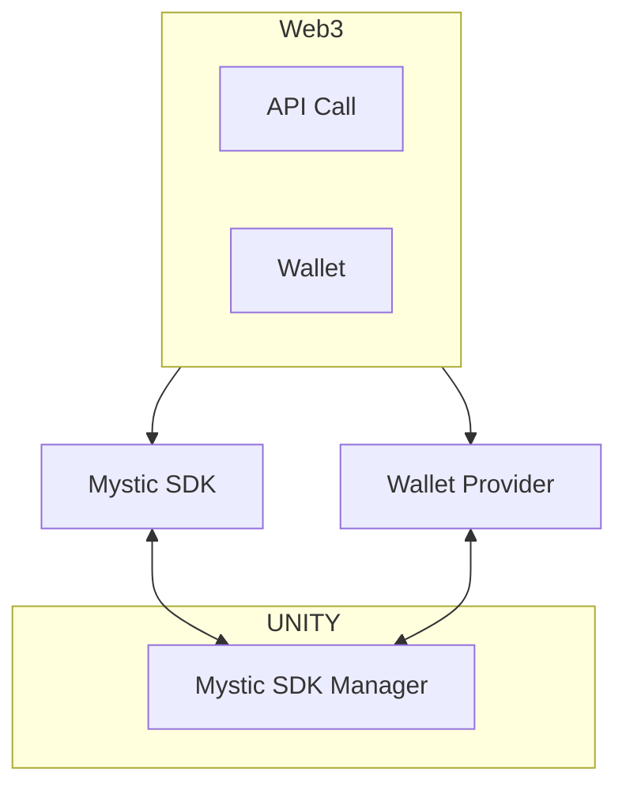

# Mystic Unity SDK Architecture

Mystic Unity SDK will do the api call to the Web3 with parameter given at Unity (Mystic SDK Manager), Wallet Provider separated from the Mystic SDK will do the Wallet thing from Web3 and give the data (wallet address) to the Mystic SDK Manager then store it. 

Just keep it mind that Mystic SDK and Wallet Provider will be provided on Unity as a package.

In the future, address and another parameters will be used on Mystic SDK to interact with Web3 such as Get_Balance, Get_NFTs, Swap, etc.